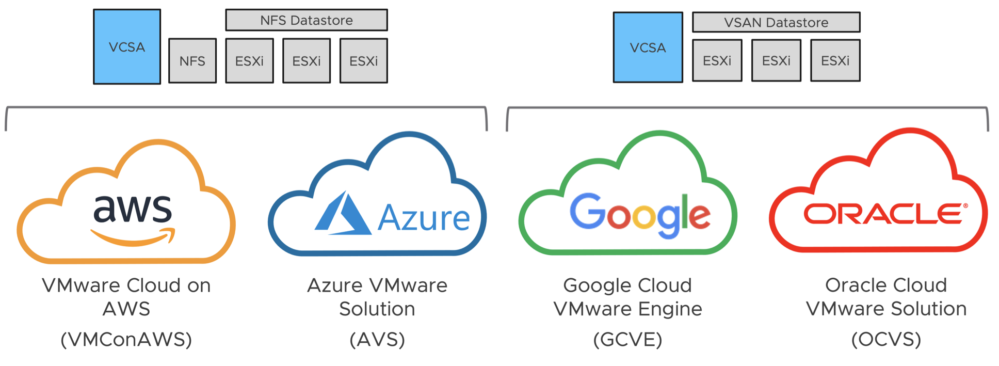

# Automated Nested Lab Deployment on VMware Cloud SDDCs



## Requirements

* Physical SDDC already provisioned running in either VMware Cloud on AWS, Azure VMware Solution, Google Cloud VMware Engine or Oracle Cloud VMware Solution
* Windows Bastion / Jumphost that  has network connectivity to SDDC management network to deploy Nested Lab Deployment
* PowerCLI 12.1+ installed on Jumphost
* [NFS PhotonOS OVA](https://download3.vmware.com/software/vmw-tools/photonos-demo/PhotonOS_NFS_Appliance_0.1.0.ova) (Required for AWS and Microsoft SDDC)

## Cloud Provider Specific Instructions

* VMware Cloud on AWS (VMConAWS) - Please see this [blog post](https://www.virtuallyghetto.com/2020/10/automated-nested-lab-deployment-on-sddc-part-1-vmware-cloud-on-aws.html) for more details
* Azure VMware Solution (AVS) - Please see this [blog post](https://www.virtuallyghetto.com/2020/10/automated-nested-lab-deployment-on-sddc-part-2-azure-vmware-solution.html) for more details
* Google Cloud VMware Engine (GCVE) - Please see this [blog post](https://www.virtuallyghetto.com/2020/10/automated-nested-lab-deployment-on-sddc-part-3-google-vmware-cloud-engine.html) for more details
* Oracle Cloud VMware Solution (OCVS) - Please see this [blog post](https://www.virtuallyghetto.com/2020/10/automated-nested-lab-deployment-on-sddc-part-4-oracle-cloud-vmware-solution.html) for more details

## Configuration

Before you can run the script, you will need to edit the script and update a number of variables to match your desired SDDC environment. Details on each section is described below.

This section describes the credentials to used to connect to your SDDC where the lab environment will be deployed to:

```console
$VIServer = "vcenter.sddc-a-b-c-d.vmwarevmc.com"
$VIUsername = "cloudadmin@vmc.local"
$VIPassword = "FILL-ME-IN"
```

This section describes the supported SDDC Providers: `AWS`, `Google`, `Microsot` and `Oracle`

```console
$SddcProvider = "AWS"
```

This section describes the location of the files required for deployment.

```console
$NestedESXiApplianceOVA = "C:\Users\Administrator\Desktop\Nested\Nested_ESXi7.0_Appliance_Template_v1.ova"
$VCSAInstallerPath = "C:\Users\Administrator\Desktop\Nested\VMware-VCSA-all-7.0.0-16620007"
$PhotonNFSOVA = "C:\Users\Administrator\Desktop\Nested\PhotonOS_NFS_Appliance_0.1.0.ova"
$PhotonOSOVA = "C:\Users\Administrator\Desktop\Nested\photon-hw13_uefi-3.0-26156e2.ova"
```

This section defines the number of Nested ESXi VMs to deploy along with their associated IP Address(s). The names are merely the display name of the VMs when deployed. At a minimum, you should deploy at least three hosts, but you can always add additional hosts and the script will automatically take care of provisioning them correctly.

```console
$NestedESXiHostnameToIPs = @{
"esxi-1" = "192.168.1.11"
"esxi-2" = "192.168.1.12"
"esxi-3" = "192.168.1.13"
}
```

This section describes the resources allocated to each of the Nested ESXi VM(s). Depending on your usage, you may need to increase the resources. For Memory and Disk configuration, the unit is in GB.

```console
$NestedESXivCPU = "4"
$NestedESXivMEM = "24" #GB
$NestedESXiCachingvDisk = "8" #GB # Applicable to Google & Oracle SDDC deployment only
$NestedESXiCapacityvDisk = "100" #GB Applicable to Google & Oracle SDDC deployment only
```

This section describes the NFS Virtual Appliance which is only applicable for AWS and Microsoft based SDDC environments.

```console
$NFSVMDisplayName = "nfs"
$NFSVMHostname = "nfs.vmware.corp"
$NFSVMIPAddress = "192.168.1.20"
$NFSVMPrefix = "24"
$NFSVMVolumeLabel = "nfs"
$NFSVMCapacity = "100" #GB
$NFSVMRootPassword = "VMware1!"
```

This section describes the VCSA deployment configuration such as the VCSA deployment size, Networking & SSO configurations. If you have ever used the VCSA CLI Installer, these options should look familiar.

```console
$VCSADeploymentSize = "tiny"
$VCSADisplayName = "vcsa"
$VCSAIPAddress = "192.168.1.10"
$VCSAHostname = "vcsa.vmware.corp" #Change to IP if you don't have valid DNS
$VCSAPrefix = "24"
$VCSASSODomainName = "vsphere.local"
$VCSASSOPassword = "VMware1!"
$VCSARootPassword = "VMware1!"
$VCSASSHEnable = "true"
```

This section describes the location as well as the generic networking settings applied to Nested ESXi VCSA & NSX VMs

```console
$VMNetmask = "255.255.255.0"
$VMGateway = "192.168.1.1"
$VMDNS = "192.168.1.100"
$VMNTP = "pool.ntp.org"
$VMPassword = "VMware1!"
$VMDomain = "vmware.corp"
$VMSyslog = "192.168.1.10"
$VMFolder = "Workloads"
# Applicable to Nested ESXi only
$VMSSH = "true"
$VMVMFS = "false"
```

This section describes the configuration of the new vCenter Server from the deployed VCSA. **Default values are sufficient.**

```console
$NewVCDatacenterName = "Nested-SDDC-Datacenter"
$NewVCVSANClusterName = "Nested-SDDC-Cluster"
$NewVCVDSName = "Nested-SDDC-VDS"
$NewVCMgmtDVPGName = "Nested-Management"
$NewVCWorkloadDVPGName = "Nested-Workload"
$NewVCWorkloadVMFormat = "Workload-" # workload-01,02,03,etc
$NewVcWorkloadVMCount = 2
```

> **Note:** If you wish to deploy PhotonOS workload VMs, you will also need to update the `$deployWorkload` variable to 1 (default is 0).